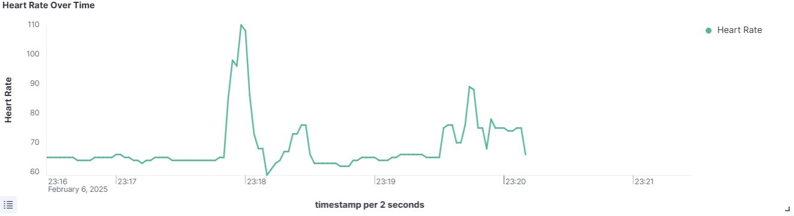
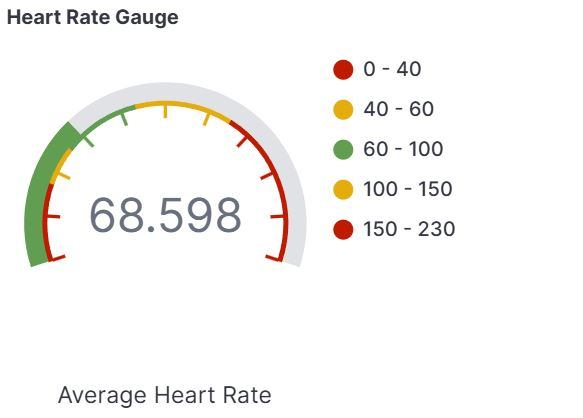
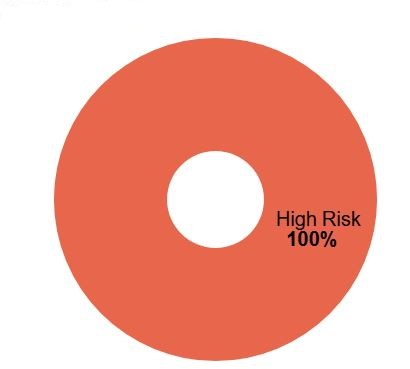
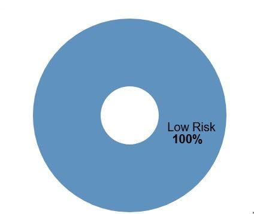
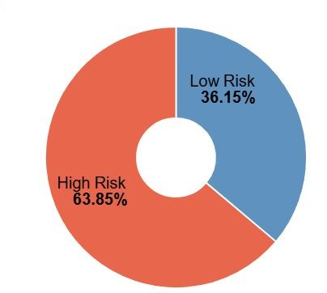

# BioWatch - Vital Signs Monitoring System
## Project description
**BioWatch** is a system for monitoring patients' vital signs, designed to support healthcare personnel in managing patients remotely by collecting, processing, and displaying real-time vital data.

## System Architecture


The architecture is made up by the following components:

1. **VitalDB**: External database of 6,388 patients consisting of intraoperative biosignals and clinical information, which is used in the project to simulate a real-time data source.
2. **VitalDBscraper** : For each patient, a dedicated Python module (e.g., vitaldbscraper_patient_1, vitaldbscraper_patient_2, etc.) extracts real patient data from the database.
3. **Fluentd** : A powerful open-source data collection tool that receives patient data extracted from Vital DB and transfers it to Apache Kafka.
4. **Apache Kafka** : Distributed messaging system for real-time data transmission, ensuring scalability and reliability.
5. **Apache Spark** : Framework for distributed processing and real-time analysis of data transmitted from Kafka.
6. **Elasticsearch** : Processed data is indexed and stored for fast and efficient retrieval.
7. **Kibana** : Intuitive dashboards for real-time monitoring of vital parameters, based on data stored in Elasticsearch.

## Workflow
1. **Data Collection:** Retrieving clinical data (age, gender, height, weight) and vital parameters via **VitalDB Web API** and **VitalDB Python library**.
2. **Preprocessing:** Only data from the **Solar8000M** device, which captures the essential parameters for human life, is extracted. The parameters extracted are: Heart Rate, Respiratory Rate, Body Temperature, Oxygen Saturation, Systolic Blood Pressure and Diastolic Blood Pressure.  **50%** of the least significant data is removed to account for the device's initial and final phases, during which the readings are either still **stabilizing** or **experiencing decay**, making them unreliable.
3. **Data Streaming:** Sending data to Fluentd via **HTTP** and forwarding it to Kafka. In order to create a realistic simulation of a real-time data source, the data is sent to Fluentd **every 2 seconds**, according to the device's sampling frequency.
4. **Data Enrichment:** Calculation of **derived parameters** (Pulse Pressure, BMI, MAP) with Apache Spark and risk classification using a **Random Forest** machine learning model trained on **[Human Vital Signs Dataset (Kaggle)](https://www.kaggle.com/datasets/nasirayub2/human-vital-sign-dataset)**.
5. **Indexing and Visualization:** Data is indexed to enable **fast and efficient searching**, while a dashboard visualization displays the evolution of parameters over time, helping to identify **trends** and detect **anomalies**.

## Steps to Run the Project

### Requirements
- Install **Docker** and **Docker Compose**
- Create an account on **Elastic Cloud** and set up a **New Deployment**

### Installation and Setup
```sh
# Clone the repository
git clone https://github.com/lorelarocca2001/BioWatch---Vital-Signs-Monitoring
cd BioWatch---Vital-Signs-Monitoring

# Configure the .env file
nano .env
# Set the following parameters:
# NUM_PATIENTS, PATIENTS_IDS, ELASTIC_HOST, ELASTIC_USER, ELASTIC_PASSWORD

# Assign permissions
chmod -R 777 *

# Build the Docker image for Spark 
docker build spark --tag tap:spark

# Train the ML model
docker run --hostname spark -p 4040:4040 -it --rm \
  -v ./spark/code/:/opt/tap/ \
  -v ./spark/dataset:/tmp/dataset tap:spark \
  /opt/spark/bin/spark-submit /opt/tap/risk_prediction_model.py

# Generate the docker-compose file
bash generate-docker-compose.sh

# Start the containers
docker compose up
```

### Import the Kibana dashboard
1. Access **Elastic Cloud Personal Deployment**.
2. Go to **Stack Management** -> **Kibana** -> **Saved Objects** -> **Import** and use the file `complete_dashboard.ndjson` in the `\kibana\dashboards` directory to import the visualizations and configurations.

## Data Visualization and Analysis
- **Time-series charts** help identify patterns, anomalies, or trends that may indicate a deterioration or improvement in the patient's condition.
  
  
  
- **Color-coded gauges** allow for a quick evaluation of the patient's overall health status.
  
<table style="border: none; width: 100%;">
  <tr>
    <td style="vertical-align: middle;">
      
    </td>
    <td style="vertical-align: middle;">
      🟢 <strong>Green:</strong> Low risk <br>
      🟡 <strong>Yellow:</strong> Moderate risk, attention required. <br>
      🔴 <strong>Red:</strong> High risk, potential emergency.
    </td>
  </tr>
</table>


- **Pie charts** provide an immediate statistical overview of the distribution of records classified as **High Risk** and **Low Risk** by the ML model. It allows us to quickly assess the patient's general health condition and its stability.

<div style="display: flex; justify-content: space-between;">
  
  
  
</div>


## Conclusion
This system automates real-time risk assessment, overcoming fixed threshold limitations and enhancing medical decision support through **Machine Learning and Big Data Analytics**.
